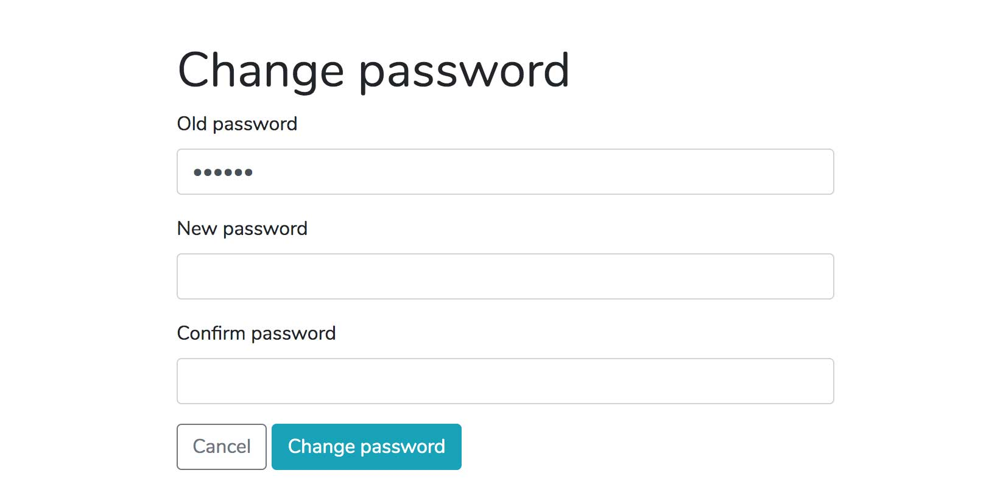

# Frontend development task

Build the form illustrated in the repository using tailwind or boostrap 4 and add validation with a JavaScript framework React. Please follow all the instructions.

### Guidelines and standards
Requirements:

* Please follow W3C guidelines (you can validate your code here http://validator.w3.org/)
* Make best use of HTML5 and ARIA semantics to ensure the form is accessible (https://webaim.org/techniques/forms/)
* Use progressive enhancement (https://www.gov.uk/service-manual/technology/using-progressive-enhancement)

1. Fork the repository into your Github account and clone the new repository
2. Create a feature branch
3. Build your form

### Development setup

Use Bootstcrap or Tailwind, Cypress CI for end-to-end testing and a JavaScrip framework React for validation. Please install the chosen frameworks via npm.

React -> Must use React Hooks Components
Install and set up Cypress CI

* Build your form with validation and error messages. Ensure the form is responsive, mobile first approach. (If time let you)
* Old password -> required
* New password -> required, min of 8 characters and a mixture of numbers and letters

NOTE: Please use atomic commits

4- Create a Pull Request
Once finished, add/commit your work and push your branch to Github, create a Pull Request and assign me [ronsandova][https://github.com/ronsandova) as the Reviewer.
